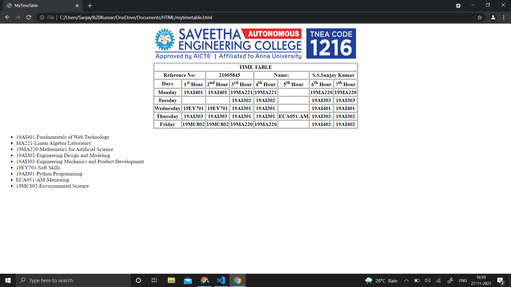
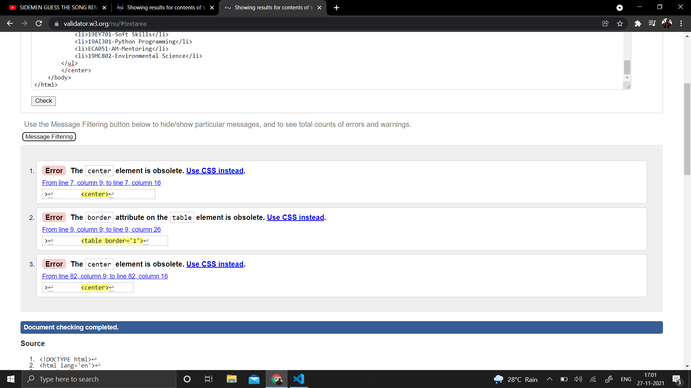

# Experiment_Time_Table

## AIM
To Write a html webpage page to display your timetable.

# ALGORITHM
### STEP 1
Create a simple table using table tag
### STEP 2
Add header row using th tag
### STEP 3
Add your timetable
### STEP 4
Execute the program

# CODE
~~~<!DOCTYPE html>
<html lang='en'>
    <head>
        <title>MyTimeTable</title>
    </head>
    <body>
        

    	
        <table border='1'>
            <tr>
                <th colspan='8'>TIME TABLE</th>
            </tr>
            <tr>
                <th colspan='2'><b>Reference No:</b></th>
                <th colspan='2'>21005845</th>
                <th colspan='2'><b>Name:</b></th>
                <th colspan='2'>S.S.Sanjay Kumar</th>
            </tr>
            <tr>
                <th>Days</th>
                <th>1st Hour</th>
                <th>2nd Hour</th>
                <th>3rd Hour</th>
                <th>4th Hour</th>
                <th>5th Hour</th>
                <th>6th Hour</th>
                <th>7th Hour</th>
            </tr>
            <tr>
                <th>Monday</th>
                <th>19AI401</th>
                <th>19AI401</th>
                <th>19MA221</th>
                <th>19MA221</th>
                <th></th>
                <th>19MA220</th>
                <th>19MA220</th>
            </tr>
            <tr>
                <th>Tuesday</th>
                <th></th>
                <th></th>
                <th>19AI302</th>
                <th>19AI302</th>
                <th></th>
                <th>19AI303</th>
                <th>19AI303</th>
            </tr>
            <tr>
                <th>Wednesday</th>
                <th>19EY701</th>
                <th>19EY701</th>
                <th>19AI301</th>
                <th>19AI301</th>
                <th></th>
                <th>19AI401</th>
                <th>19AI401</th>
            </tr>
            <tr>
                <th>Thursday</th>
                <th>19AI303</th>
                <th>19AI303</th>
                <th>19AI301</th>
                <th>19AI301</th>
                <th>ECA051-AM</th>
                <th>19AI302</th>
                <th>19AI302</th>
            </tr>
            <tr>
                <th>Friday</th>
                <th>19MC802</th>
                <th>19MC802</th>
                <th>19MA220</th>
                <th>19MA220</th>
                <th></th>
                <th>19AI402</th>
                <th>19AI402</th>
            </tr>
            
        </table>
        

        <ul>
            <li>19AI401-Fundamentals of Web Technology</li>
            <li>MA221-Linear Algebra Laboratory</li>
            <li>19MA220-Mathematics for Artificial Science</li>
            <li>19AI302-Engineering Design and Modeling</li>
            <li>19AI303-Engineering Mechanics and Product Development</li>
            <li>19EY701-Soft Skills</li>
            <li>19AI301-Python Programming</li>
            <li>ECA051-AM-Mentoring</li>
            <li>19MC802-Environmental Science</li>
        </ul>
    </body>
</html>

~~~
# OUPUT

# RESULT
Thus,a HTML webpage is created to display timetable.
